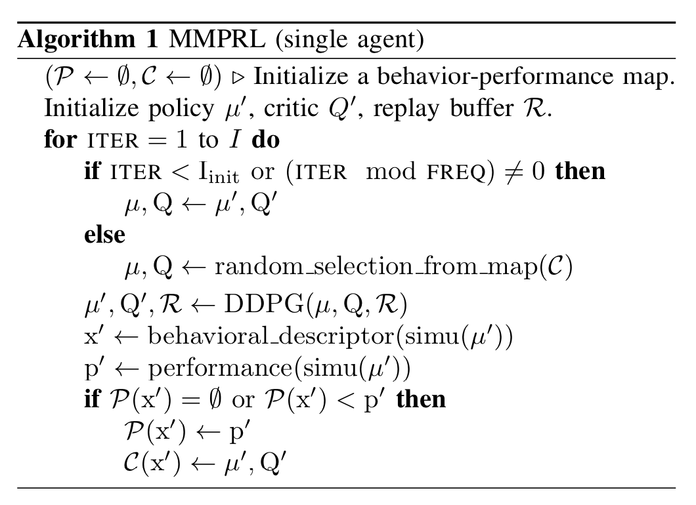
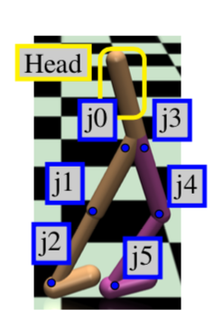
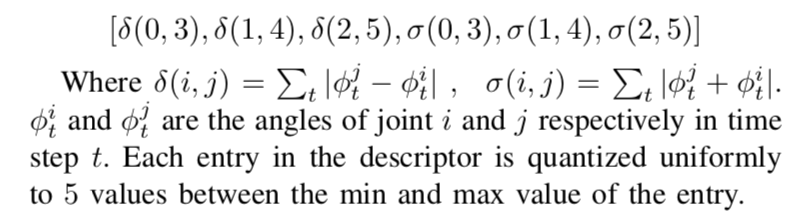
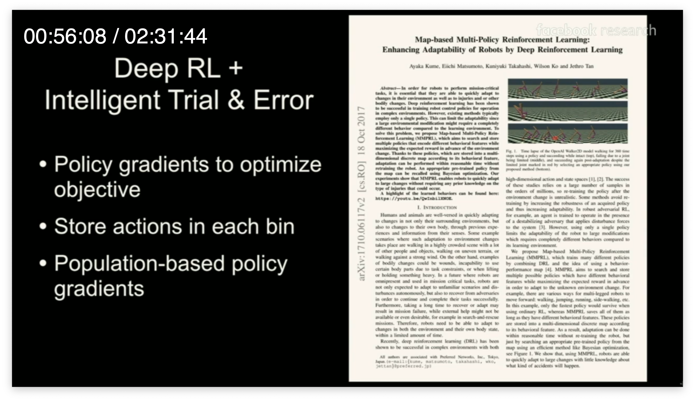
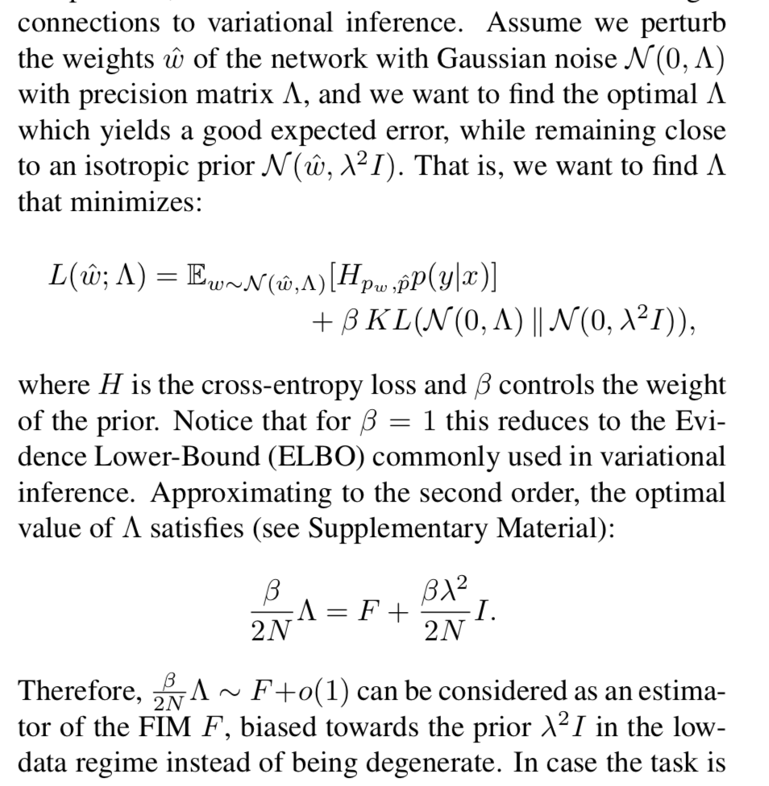
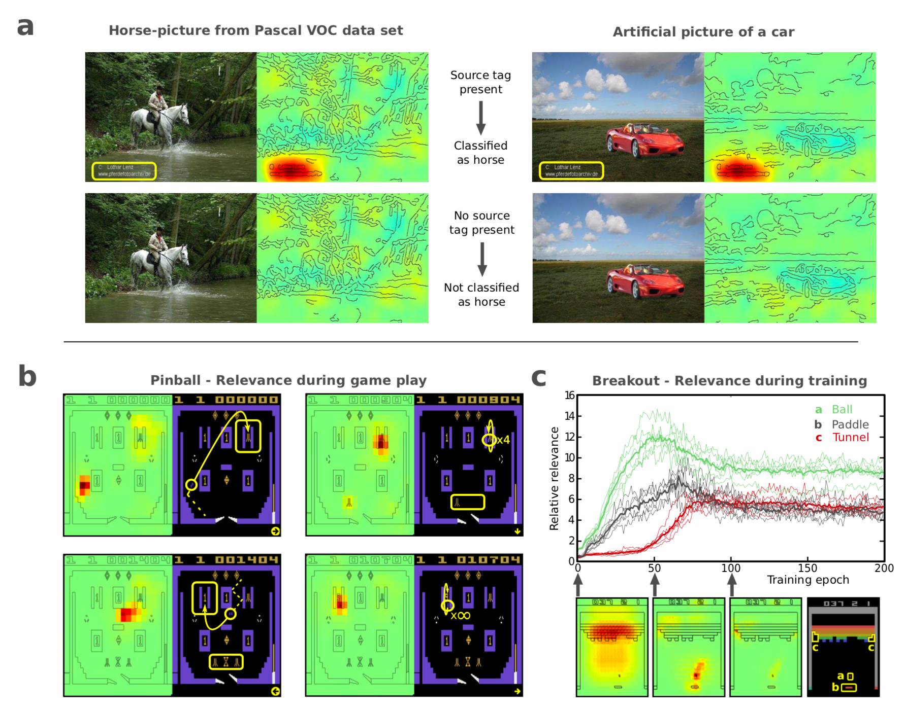
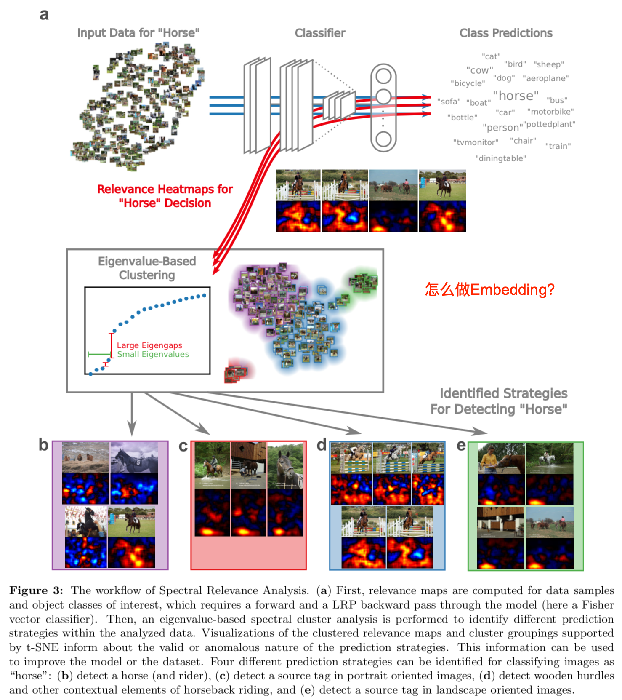
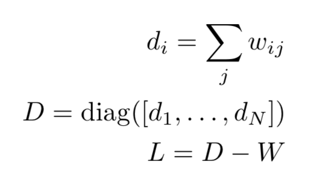
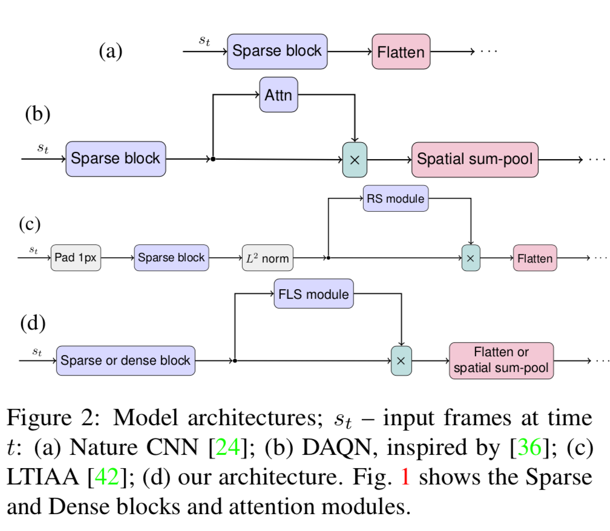

# 论文笔记集

:fountain_pen: 彭正皓

 

> 雄关漫道真如铁，	Idle boast the strong pass is a wall of iron,
> 
> 而今迈步从头越。	With firm strides we are crossing its summit. 
> 
> 从头越，	We are crossing its summit, 
> 
> 苍山如海，	The rolling hills sea-blue, 
> 
> 残阳如血。	The dying sun blood-red.

 

## 目录

[TOC]

规则：

* 论文从第四档标题开始，预留第二档、第三档标题分类用。
* 论文模板在本文档的隐藏内容中。

<!-- 

## 笔记模板

#### 论文标题

##### 前言

##### 方法

##### 实验设计和结果

##### 总结
-->

## 进化算法

#### Improving Exploration in Evolution Strategies for Deep Reinforcement Learning via a Population of Novelty-Seeking Agents

本文把Novelty Search和Quality Diversity两种算法和ES结合在一起了。ES的具体原理就是施加噪声，然后利用Reward做加权得到梯度，然后更新。非常简单的东西。作者这里人为设定了Behaviour Characterization，然后用population中不同agent的BC的距离来表示Novelty，从而引入NS和QD的算法。

作者指出QD和NS可以理解成利用一群Population来进行探索，而非一个Agent单打独斗，于是这样有扩展Exploration的作用，即从专才变成了通才。

#### Learning Behavior Characterizations for Novelty Search

Behavior Characterization (BC) 将一个agent map到“行为”上，即一个表示它是什么或做了什么的向量。（这不就是我们要找的吗）本文学到的BC将用来做进化，在解迷宫问题上得到了测试。task：一个fitmess函数和一个环境。domain：一组task，用同一个BC都可以阐述。

作者指出，最简单形式的BC是：Stochastic Policy Induction for Relating Inter-task Trajectories（SPIRIT），具体而言就是：以agent在特定状态下执行特定动作的概率。设可能的state：{s1, ..., sn}和可能的action：{a1, …, am}，则BC为长度为nm的向量，

上图：一批随机Policy I，和一批随机policy S。看看怎么样才能最快的从I到S）

这有点类似于QD某篇文章说的用Agent朝向东南西北所占的时间比例作为表征。但是很不幸这个需要离散的状态和动作空间。

作者随后说，所谓Learning就是给BC施加一个权重向量。那么不同的方法就是不同的权重向量的获得方式。作者拿出一批随机的Policy和一批训练完毕的成功policy。然后看看这两批policy的默认BC。看看这两批Policy的两批BC在哪个维度上区别最大，然后对应的施加权重，那么就可以得到一个新BC。

在AURORA文（见下）中有提到这篇文章，那个作者指出本方法需要定义“成功个体”的概念，这就引入了先验知识。

#### Hierarchical Behavioral Repertoires with Unsupervised Descriptors

Antonie Cully, Yiannis Demiris

用了一个有层级的行为表征。主要任务是机械手学会画数字。在机器人领域用一批diverse的行为可以拓展机器人的适应性和鲁棒性。

假设下面那个空间表示“agent画点”，那么中间这个空间就表示下面空间的一系列行为的序列，比如从一个点到另一个点。于是中间空间就表示“agent画线”。上面这个空间就是“agent画弧”。

机械臂画数字，这个数字被转换成图像，扔进MNIST的一个autoencoder中，于是得到了这个“机械臂数字->AE内部表征”。

因为有了这种层级表征，所以当我们替换最底层的Behavioral Repertoies为其他机器人的的时候，就可以transfer了。

补充：最底层的这个空间中的点到底是什么意思？答：指的是机械手最基本的一些行为，比如说，“移动到空间(x, y)”，既代表着“一个行为”，也代表着“一个执行这个行为的机械操作”，后者我们就不管他了。

思考：这个东西主要还是在机器人层面用…因为他有一个很明确的“basic behavioral descriptor”。

#### Using Centroidal Voronoi Tessellations to Scale Up the Multidimensional Archive of Phenotypic Elites Algorithm

有点意思，摘抄一下AURORA对他的评价：

AURORA的作者谈到这篇文章的时候，说为什么它的结果比直接用MAP-elite好呢？因为，假设你采样了50step，每个step有一个（x，y）的坐标，那么这个BC就是100维的。在MAP-elite中，把这个100维空间给离散化，那么必然的有大量的cell是不会被填上的（因为不符合物理原理）。而CVT-MAP-Elites这个方法只采样可能的轨迹，因此就好了很多

EA算法以前是作为优化算法用的。但是越来越多的人把它作为“diversifier”，比如扔进Novelty Search算法中去。

（全局优化算法就要一个结果。多目标算法可能给出几个。population-based算法直接给你一群。）

笔记正文开始：MAP-Elits对高纬度的BC空间无能为力。本文提出的方法可以给出几个指定数目的region。因为高维度的空间可以被分成若干个区域。本文运用Centroidal Voronoi Tessellation（CVT）可以将高维空间划分成若干个区域。然后就可以将任意一个高维点放进最近的区域中去。那么，相对于直接食用MAP-Elites算法把BC空间划分成一堆网格，本方法就将这个空间划分成K个区域。（格子从网格变成了不规则形状的区域）。本文就看到这里。

#### Autonomous skill discovery with Quality-Diversity and Unsupervised Descriptors

(AURORA)

这个图是在ICML2019的讲座上出现的引用这篇文章的图。

简单概述了一下QD的流程：

1. 随机生成一定数量的初始agents
2. 计算BD（behavioral descriptor）
3. 根据BD归类（放进Map-elites里面）
4. 从map里挑选一个agent，mutate然后回到步骤2.

本文希望能够让robot自己了解到自己的能力，而不需要任何人为给的先验知识。本文不需要提前获取什么数据集，本文只要agent自己和环境进行互动即可。

作者指出，为什么CVT-MAP-Elite是不行的？因为，他假设你可以采样到所有可能的states。但是问题是你采样到的state跟你本身的行为有关，如果你只会做A，那么你采样到的state只有A的，而可能你“冥冥之中”是会B的，但你采样不到B的轨迹。

AURORA的初始化步骤：

1. 首先用随机agent采样得到一个dataset

2. 用DR（降维）算法训练

3. 然后把dataset拿来降维，用结果作为BD

然后开始Quality Diverse步骤：

1. 随机挑选agent
2. 计算BD（这里用学习到的DR算法作为BD）
3. 扔到MAP-Elites格子里面去

在适当的轮数之后，重新学习DR算法。补充：扔进DR算法的东西是一个100维度的向量。表示50step，每个step有个(x,y)坐标。

#### Unsupervised Learning of Goal Spaces for Intrinsically Motivated Goal Exploration

本文提到了一个KL Coverage的指标，可以用来衡量两个repertory的差异。

Intrinsic Reward用来寻找Diverse的动作。那么其实这个外界的刺激，本身可以理解成agent的任务发生了变化，即goal发生了变化，从原来的reward对应的那个task，变成了task+novel。因此，intrinsic reward可以理解成在goal空间中给了一个新的goal。

这里说如何才能自动生成goal呢？其实这里的goal和我们说的BC可以等价。因为这里的goal指的是agent以某种方式运动，或者说环境发生了某种形式的改变。那其实，goal空间不就是我们说的behavior空间嘛。总之就是要有一个空间来表示一个agent，或者一类行为，或者一类环境发生的改变。（agent X 环境 = 行为）

作者指出：forms of random goal exploration are a form of intrinsically motivated exploration

那么怎么选取不同的goal呢？这就变成了一个meta-learning的问题。除了我们随机的选择goal，就像随机的鼓励intrinsic reward一样，其实还有别的更好的方法（编者：咦？这不就是我想要的有目标的去调整行为嘛！看来meta-learning也要看一看。）

众多goal的选取的方法都要求用户给定一个goal的形式，并且给一个函数来衡量agent是否已经达成了goal。这就有问题了：

1. 能不能让agent用无监督学习的方法，在它实现了这个goal之前，就已经学习到了这个goal的一种表征？
2. 对于一个学习到的goal的表征，如何选取“interesting goal”呢？这个goal不能太夸张，太不合实际。
3. 这个无监督学习的方法效率不能太差。

本文提出IMGEP-UGL算法，分成了深度表示学习和goal探索两个步骤。第一步先学会这个世界的“configure”，就像婴儿睁眼看世界一样，第二步从这个世界模型中采样出goal来进行下一步活动（婴儿学会爬行和走路）。

Intrinsically Motivated Goal Exploration Processes (IMGEPs) 一种启发式算法，从高维连续动作空间中学习forward和inverse的控制模型，以解决robotic问题。

很有意思的点，作者将Exploration Process理解成：

1. Context：一些agent不能操控的东西，比如环境的dynamic
2. Parameterization：agent能够改变的东西，比如policy的参数
3. Outcome：对行为的一种characterization
4. phenomenon dynamics：从parameter到outcome的映射关系。

在developmental robotics中，希望学到一个forward模型：context+param->outcome和一个inverse模型：context+outcome->param。一个简单的想法就是用各种随机的param来拟合这两个模型。但是在参数空间中有大量的参数组合是没用的。所以IMGEP就是用来解决这个问题：它希望找到一种sample参数的方法，以得到最有价值（informative）的那些sample。

IMGEP定义了：

1. Goal Space：基本等价于Outcome，指我们希望agent做什么样的事情
2. Goal Policy：关于goal的概率分布，采样用。（这个policy不是那个agent的policy）
3. A set of Goal-parameterized Cost Functions：给定一个outcome，给我一个fitness/performance/reward/cost。
4. Meta-Policy：给定一个goal和context，给我一个policy（即给我一组param来得到一个policy）。具体而言是：$f(goal, context) =argmin_\theta C_{goal}(Outcome(\theta, context))$

编者注：这套流程就是我要的retrival啊！但是现在暂时还不说这个，我想知道的事outcome的表征。

作者指出，outcome space的结构是人为给定的，这样不好，所以他打算用深度表示学习的方法来自动学习这个表征。也就是AE、VAE等方法。

它的网络：

输入的是随机抽取的一些图像。我的问题是，输入的是一个step的东西，为什么中间的这个表征可以代表一个agent？答：因为“到达某个state”本身就是“goal” 啊。哦，所以看来看去这个文章只是在探究一个机械臂能够伸到哪些地方。这并不是我想要的对行为的characterization。

#### Policy Distillation

各种策略如何融合。需要训练。这个可能对我们最后retrive那个步骤有用。

#### Unsupervised Learning and Exploration of Reachable Outcome Space

唯一一篇引用AURORA的文章。应该说已经站在了最前沿。

作者指出AURORA的observation和系统的low-dim state是直接相关的（比如robot在移动自己），然而如果robot的state和env的state的低维形式并不能直接拿到的话就不行了。

本文使用novelty和suprise两个概念。novelty：outcome space的距离。surprise：AE的重构误差。

本文引用了Novelty Search作为formulation。简单的概述NS如下：

1. 定义一个从policy到BD（behaviour description）的函数
2. 对于一个policy，计算它和K临近policy的distance（对应BD的欧几里得距离）
3. 留下最novel的agent。mutate，回到步骤2。

作者用了最后一帧的obs来做AE的输入。这点我非常的不认同。

然后作者把novelty和suprise两个东西结合起来了，这点非常好。因为引入了AE才有的suprise，把它加入进来很合理（也很新颖）。

作者在结论部分说，这个AE可以用来做retrieveal，因为只要把你想要的最后一帧outcome输入进去，得到内部表征，然后在population中寻找最接近它的那个agent，就完事儿了。

#### Behavioral diversity with multiple behavioral distances

（2013）混合了多种Bahaviour Descriptor

Behavioral Similarity Measure（BSM）是进化机器人学很重要的问题。作者说其实在用它做进化算法的时候不一定要选择一个，我全都要。

在进化机器人学（Evolutionary Robotics，ER）中，观察到可能很多的genotypes会带来相似的行为，而只有一点点差别的genotypes会带来很不同的行为。所以只考虑genotypes的多样性是不够的，真正重要的是在行为空间中的多样性。有各种各样的BSM来衡量这个多样性，但是我们很难找到最优的那个。所以为何不把它们融合起来？

第一种方法就是求平均值。任何一个BSM，将其除以最大值之后，求平均值。

第二种方法就是选定一个BSM，然后在一定的时间之后随机的跳到另一个BSM。

很无聊啊这文章…………但我们可以看看他有什么五种BSM，有没有值得学习的：

1. adhoc：最后一刻的位置。
2. hamming：最后4000时刻，存储每个传感器的值，这样你就有4000*x个值了，这作为一个behavior的表征。然后对两个行为之间求hamming距离（bit的差异数目）。
3. trajectory：50时刻的robot的位置
4. entropy：比较复杂，而且看起来挺厉害的，看看实验结果如何，好的话可以拿过来。一般，不如trajectory。

#### Evolving a Behavioral Repertoire for a Walking Robot

**（一把学全部！！）**

一组简单的控制器，每个负责往一个方向走，那么把他们融合起来就会得到一个掌握了往各个方向走的技能的agent。

因此，本文的核心任务就是“evolving a repertoire”。学会各种简单的任务，比学会一个复杂的任务要简单。独立的学习不同任务可能会很昂贵。因此作者提出的Transferability-based Behavioral Repertoire Evolution algorithm (TBR-Evolution)将问题从一个agent的许多许多技能变成了学习许多许多个各不相同的agent。

(TODO)

#### Discovering the Elite Hypervolume by Leveraging Interspecies Correlation

(TODO!!)

## Multi-agent RL

#### Influence-based Multi-agent Exploration

出发点非常的有道理：既然是MARL了，Exploration的过程也该有协调才对。

所以作者提出了两种协调方式：

##### Exploration via Information-theoretic Influence (EITI)

使用互信息来描述“Influence Transition Dynamics”

##### Exploration via Decision-theoretic Influence (EDTI)

使用新的Intrinsic Reward，称为“Value of Interaction”来描述和定量分析一个agent的行为对别的agent的影响。

（TODO这是一个好文章，要认真读一下）

#### Map-based Multi-Policy Reinforcement Learning: Enhancing Adaptability of Robots by Deep Reinforcement Learning

在摘要中写到几个两点：

1. 在保证最大化return的前提下，寻找和存储各种行为的agents于一个有多维度的离散Map中。
2. 可以快速进行Adaptation，不需要重训练
3. Agents可以快速适应大的变化而不需要知道有关“他自己受伤”的先验信息。

作者将Map Elites中原来的那个Mutation换成了DRL。作者用了DDPG。

原来Cully在做断腿恢复的时候，分为两个步骤，第一个步骤建立Map，第二个步骤引入Adaptation Phase。第二个步骤使用贝叶斯优化的方法，在第一步建立起来的Map里寻找“最适合如今形势”的policy。（没有细看原理，如有必要可以翻看贝叶斯优化和Cully那个Nature断腿求生文章。）

算法流程：

1. 首先初始化一个Map。每个agent训练自己的actor和critic直到指定数目的iteration结束。构造一个map。
2. 如果频率到了，就把如今的actor、critic换成在Map里随机抽取的。然后用DDPG继续训练。

所以我们可以看到，其实这个训练吧，还是序列化的进行的。而且没什么创新……就是把Mutation换成了DDPG而已……而且作者说，用DDPG就是看中了他的训练不稳定性，这样他就有很大的随机性了。

值得一提的是，作者用了Walker环境和蜘蛛人两个环境来训练。Walker环境他人为定义了Behavioral Descriptor：

补充一下，在Clune的ICML2019演讲中，略带了这篇文章。

很可惜，即使是训练DRL，也没有【额外的指示】来帮助寻找下一个Map。

## Meta Learning

#### TASK2VEC: Task Embedding for Meta-Learning 

embedding的大小（norm）表示task的复杂程度，距离表示相似性。embedding表示了input domain的特性。

作者发现权重相对于与task有关的loss的梯度也是一种rich representation of task，就像feature是关于输入图片的一种rich representation一样。

task的定义：一个有标签的数据集。

作者将数据集喂给一个已经训练好的“probe network”，计算网络参数的diagonal Fisher Information Matrix（FIM），得到task的结构。因为probe网络是固定的，所以这个Fisher Information Matrix也是固定的。

Task Embedding可以用来了解Task Space，并解决“meta-tasks”（？？？）。为了解决Task2Vec只考虑了task而不考虑模型性质的这个问题，作者还提出了Model2Vec，然后就可以把Model Embdding和Task Embedding一起比较从而来帮助选择pretrained model。（？？？好牛逼的样子）

##### Task Embedding via Fisher Information

先考虑如何知道权重的重要性。扰动权重：$w' = w + \delta w$ 观察输出的预测分布的KL散度：

$E_{x} KL(P_{w'}(y|x) || P_{w}(y|x)) = \delta w\cdot F\delta w + o(\delta w^2)$

右手边是KL散度的二阶展开。F就是Fisher信息矩阵：

$F = \mathbb E_{x, y\sim P_w(y|x)}[\nabla_w \log P_w(y|x)\nabla_w \log P_w(y|x)^T]$

* FIM是概率分布空间中的一个黎曼距离。如果一个权重关于最终表现的影响不大，那么这个权重对应的行和列都应该比较小。
* FIM和Kolmogorov task复杂度有关。
* FIM可以理解成是一个Hessian of the cross-entropy loss的容易计算的、正定矩阵的、上界的近似。

彭：让我把这个式子拆开来看：

$F_{ij} =  \mathbb E_{x, y\sim P_w(y|x)}\{ [\nabla_w \log P_w(y|x)]_i [\nabla_w \log P_w(y|x)]_j \}$

也就是说，在给定数据集的情况下，这个矩阵就是各个权重的梯度。应该是对角矩阵。很尴尬的是，这里其实涉及到三组向量，输入、权重、输出，这三个向量的维度都很巨大。所幸的是，作者使用的是输入和输出都直接采样了。

*彭：这个思路好啊，我们把一个agent采集到的数据作为一个dataset（这样task对应于agent，image对应于frame），就可开搞了！*

##### Task2Vec Embedding using a probe network

直觉：我们知道网络的激活值包含了input的信息。FIM则包含了对如今task更有用的一群feature map。

作者使用ImageNet预训练的神经网络作为特征提取器，只训练最后一层分类层。然后计算特征提取器的参数的FIM。然而CNN的参数实在是太多了，因此作者还进行了两个修改：（1）只考虑FIM的对角线元素，也就是自己和自己比了。（2）对一个filter，均一化其中的参数的FIM（因为同一个filter中的权重可能有关联，那干脆直接平均好了）。

作者指出，FIM是一个局部数值，反映了training loss附近的局部空间。这个空间（平面）是高度不规则的。为了解决这个问题，作者提出了一个鲁棒的近似器，与variational inference有关。简而言之就是给出了一个Loss，优化它，得到一个东西，可以代替FIM。反正这段我看晕了。关键词：Stochastic Gradient Variational Bayes，Local Reparametrization Trick，Variational Inference。

##### Properties of the Task2Vec embedding

作者说一个domain embedding，比方说输入x的协方差，或激活值z的协方差，这个矩阵就与label无关，因此叫做domain embdding。而上面提到的是task embedding，它跟label有关。对比这两个东西有一些有趣的性质：

1. 关于标签的不变性：改变输出的类别、改变输出的顺序，并不会影响结果。因为我们只针对特征提取网络中的权重来搞。
2. 任务的复杂度也考虑了：如果网络对输出特别自信，那么那个位置的F值是接近于0的（log 1）。所以FIM值越大，任务复杂度越大。实验有显示FIM值越大，Test Error越大。
3. 任务的域domain也考虑了：那些把分类器搞糊涂的样本点，也就是 p=0.5 的数据，对于embedding的贡献更大。（为什么？以及这怎么就证明了domain也考虑了？）
4. 将任务的有用的特征都包含进来了：因为采用FIM的对角线上的值，它表示了权重的改变会如何影响输出，这反映了Loss曲面在权重空间中的形状。而且这个形状是跟task有关的。因此我们说其反映了跟task有关的特征。相反，如果你只考虑feature的协方差矩阵，那么他只反映了你改变权重会怎么改变激活值，而不会告诉你这个改变与task有什么关系。

##### Similarity measures on the space of tasks

meta-task：通过观察已知的数据集，在许多预训练网络中选择一个最好的，以帮助提升表现。

*彭：假设task->agent，则这算不算就是agent-retrieval了？*

##### Model2Vec: task/model co-embedding

$m = F + b$，其中b是一个可以学习的向量。做了一个简单的Loss：给定一堆model embedding（这时你就有了一堆待训练的b），最大化选择best model的概率。这里有点乱搞，所以略过。

##### 结论

可看的参考文献：

[9]：H. Edwards and A. Storkey. Towards a neural statistician. arXiv preprint arXiv:1606.02185, 2016. 

Autoencoder跨不同的数据集学习固定长度的embedding。但作者说对于自然图象，数据集的domain是一样的，因此不能使用这种方法。（暗示这个方法假设数据集的domain是不一样的）。

[18]：D. P. Kingma, T. Salimans, and M. Welling. Variational dropout and the local reparameterization trick. In *Advances in Neural Information Processing Systems*, pages 2575– 2583, 2015. 3, 13 

用来训练鲁棒版本的FIM。有一个神奇Loss，和Reparametrization Trick。

## Interpretation

#### Unmasking Clever Hans Predictors and Assessing What Machines Really Learn 

Wojciech Samek。

Test Error和平均Reward不能代表agent的决策。我们需要理解决策的机制（无论是图象任务还是打游戏）。作者因此提出了一个半自动的“Spectral Relevance Analysis”可以characterizing、验证一个模型的行为。

观点：

1. 有的时候模型会发现训练数据的奇怪关联，从而假装自己已经学会了（就是过拟合啦）。这在心理学上称为[Clever Hans phenomenon](https://en.wikipedia.org/wiki/Clever_Hans)。
2. 去**解释模型怎么预测一个单独的样本**，比告诉你一个feature在整个数据集中是什么作用有时候更有意义。
3. 有时候虽然不同的模型表现是相似的，但是行为非常不一致。（彭：对啊，RL的时候见得太多了。反而在CV的时候这种不一致还不太好观察。）
4. 理想的解释方法能够给出一个从输入到输出的因果链。
5. Layer-wise Relevance Propagation（LRP）很重要。作者并提出了SpRAy（Spectral Relevance Analysis）可以半自动的识别大量决策行为，从而可以帮助我们去取消那些奇怪的行为。最后，作者的半自动异常检测算法就可以用end-to-end的来评测ML模型在测试集准确率或Reward之外的性能。

##### 几个LRP和SpRAy的展示例子

作者先开始展示了几个例子。

第一个展示（a）是，在某个分类任务中，马匹的图片左下角都有水印。Fisher Vector模型的Heatmap（根据LRP方法给出的Heatmap）显示它指关注这个水印。而DNN模型则关注马头马身之类的。然后作者试了各种取消tag或者把tag放在别的类上，得到结论Fisher Vector模型确实失败了。

第二个展示（b）是，在Atari打弹珠的任务中。作者观察到agent学会先触碰一个加速器开关，然后再一直循环打球。

第三个展示（c）是一个很好的训练结果。在训练的后期Agent学会了关注真正有用的区域。

总而言之，这些展示都是为了显示Heatmap的作用。那么问题来了，到底Heatmap怎么产生？

##### Layer-wise Relevance Propaghation（LRP）

假设神经网络的输出和输入有直接的关系：$f(x) = \sum_p R_{p}^{(1)}$，p表示pixel，1表示第一层。然后再定义一个简单的传播法则：$R^{(l+1)}_j = \sum_{i} \frac{z_{ij}}{\sum z_{ij}}R^{(l)}$ 其中z为神经元i对j的贡献，也就是$w_{ij}a_i$ 权重乘以它的激活值。

总之，LRP就是定义了这么一批概念，传播法则、“贡献”等等。计算LRP的时候需要Back

##### Spectral Relevance Analysis

步骤如下：

1. 先用LRP得到你感兴趣的那个照片的Relevance Map
2. 降维，并使得这些Map的尺寸一致
3. Spectral Cluster在relevance map上进行分析。至此为止，我们得到了relevance map的结构，并且将分类器的行为分成了几个聚类。（彭：哇，分类器的行为的聚类！）
4. 通过eigengap分析识别出我们感兴趣的聚类。SC的特征值光谱（eigenvalue spectrum）包含了relevance map聚类的信息。（见下）
5. tSNE聚类可视化。（第四步会得到一个sample-sample的矩阵，这个矩阵可以变成距离矩阵，然后扔给tSNE进行聚类）

SpRAy对Heatmap进行操作，而不是对原始的图像进行操作。

##### Spectral Cluster

首先计算一个sample-sample的矩阵，$w_{ij} = 1$ 表示j在i的k近邻中，反之为0。然后定义拉普拉斯矩阵L：

对L进行特征值分解可以得到N个特征值和特征向量。特征向量就是“表征”。

##### Eigengap

前面说有N个特征值。我们知道最小的特征值等于0。且等于零的特征值数目表示聚类的数目。但有的时候可能数据点没有分的太开。这个时候，我们会注意到有的特征值接近0，然后有的特征值远大于0。这中间存在一个gap，就是特征值急剧升高的gap。我们设定一个threshold的话就可以发现这个gap，从而区分开不同的特征值，从而知道聚类的数目。

##### 总结

1. SpRAy让用户可以发现分类器的决策过程。
2. Spectral Analysis可以直观的展示Prediction Stategies（因为聚类了）

感觉不太能用啊，因为：

1. LRP只针对离散的输出？比如分类任务、或Atari（有待确认）
2. 整个操作的对象都是图片
3. 都是单张图片，而不是agent本身的决策序列。

#### Free-Lunch Saliency via Attention in Atari Agents 

为特征提取器添加了一个attention模块称之为FLS（Free Lunch Saliency）。可以生成saliency map，反应目前agent正在看哪里。

太无聊了。增加一个attention模块然后干啥干啥的。毫无新意。不看了。